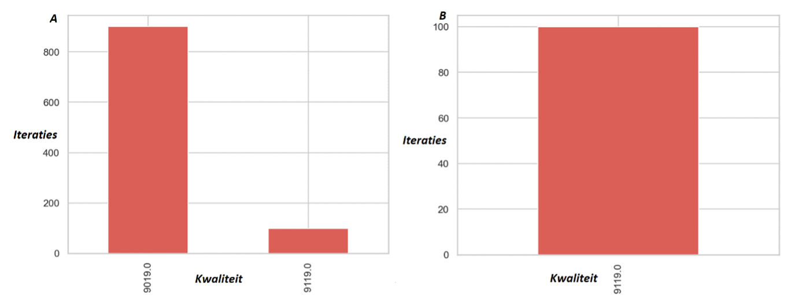
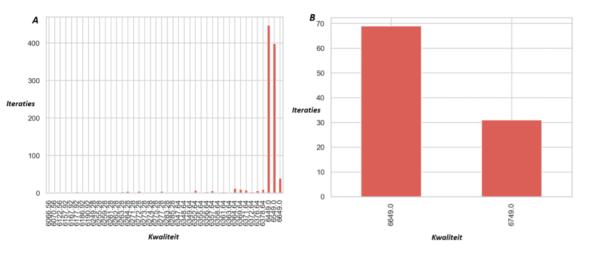

# Experiment

## Eerste Analyse: 
**Kwaliteit Traveling Salesman en Simulated Annealing**

### Holland
```
Simulated Annealing max score: 9119.0
Traveling Salesman max score : 9119.0
```


De Simulated Annealing (SA) algoritme heeft een hogere maximale kwaliteit dan het Traveling Salesman (TS) algoritme. De kwaliteit van de lijnvoering bij het TS is verdeeld in een kwaliteit van 9019 en 9119 *(Figuur 1A)*. De hogere kwaliteit (9119) bij TS is gelijk aan de kwaliteit van SA *(Figuur 1B)*. Dit komt omdat het TS één bepaalde richting kiest en daarop een traject creëert; bij SA worden de trajecten die bij TS gecreëerd zijn aangepast en verbeterd. Bij SA zal dit dus altijd resulteren in een optimale kwaliteit van de lijnvoering. Verder is het SA honderd keer uitgevoerd en TS duizend keer. Dit komt omdat de kwaliteit van de SA naar 100 keer al stabiel is; bij TS duurt het langer voordat de kwaliteit stabiel is. 



*Figuur 1. A. Barplot van de verdeling van de kwaliteit van het TS algoritme op Holland-gebied na 1000 iteraties. De x-as is de kwaliteit en de y-as hoe vaak deze kwaliteit de uitkomst was van het algoritme. B. Barplot van de verdeling van de kwaliteit van het SA algoritme op Holland-gebied na 100 iteraties. De x-as is de kwaliteit en de y-as hoe vaak deze kwaliteit de uitkomst was van het algoritme.*

### Nationaal
```
Simulated Annealing max score: 6749.0
Traveling Salesman max score : 6649.0
```
SA algoritme heeft weer een hogere maximale kwaliteit (6749) dan TS (6649). Op nationaal niveau hebben TS en SA allebei een kwaliteitsverdeling (Figuur 1A, 1B). Verder is er een sterke verdeling te zien bij TS. Dit komt omdat alle lijnvoeringen waarin niet alle verbindingen worden bereden ook in de barplot worden gevisualiseerd. Ook is het daarbij belangrijk om te realiseren dat de verdeling waarschijnlijk nog beter te zien is bij meer iteraties. De verdeling bij SA wordt hoogstwaarschijnlijk veroorzaakt door toeval. Omdat er maar 100 iteraties zijn bij SA, is de kans groot dat de verdeling die nu te zien is van de kwaliteit, 6649 (~70%) en 6749 (~30%), waarschijnlijk bij een hoge hoeveelheid iteraties 50%-50% wordt. 



*Figuur 2. A. Barplot van de verdeling van de kwaliteit van het TS algoritme op spoorwegen van Nederland na 1000 iteraties. De x-as is de kwaliteit en de y-as hoe vaak deze kwaliteit de uitkomst was van het algoritme. B. Barplot van de verdeling van de kwaliteit van het SA algoritme op spoorwegen van Nederland na 100 iteraties. De x-as is de kwaliteit en de y-as hoe vaak deze kwaliteit de uitkomst was van het algoritme.*

## Conclusie eerste analyse
Vanuit de eerste analyse kan er verondersteld worden dat de SA een hogere maximale score heeft op nationaal niveau (6749) dan TS (6649) (Figuur 2). Op Holland niveau zijn de maximale scores van de twee algoritmen gelijk, beide 9119 (Figuur 1). Er kan ook geconcludeerd worden dat de kwaliteit gemiddeld wel hoger is bij SA (GEMIDDELDE TOEVOEGEN) dan bij TS (GEMIDDELDE TOEVOEGEN). 
