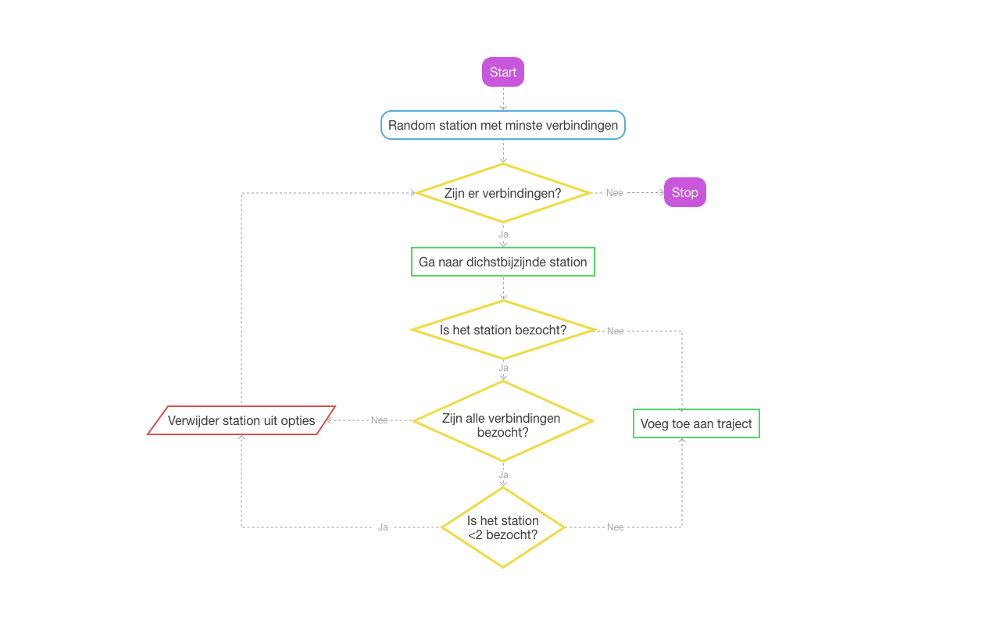
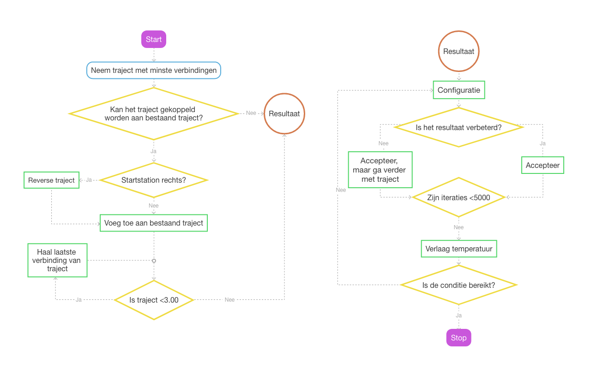

# TLL Solutions
**Datum:** 2 februari, 2022

**Opleiding:** Minor Programmeren

**Vak:** Programmeertheorie

## Authors

- [@Tim Mulder](https://github.com/ergodia)
- [@Luca Nederhorst](https://github.com/Lepel1998)
- [@Lieneke Floor - Barsukoff Poniatowsky](https://github.com/LFloor)

## Doel van dit project
Het maken van de lijnvoering van intercitytreinen in Nederland met een hoge kwaliteit. Binnen het gegeven tijdsframe van 3 uur worden er een aantal trajecten uitgezet. Het maximaal toegelaten aantal trajecten is 20. Een traject is een route van sporen en stations waarover treinen heen en weer rijden. Een traject mag niet langer zijn dan het opgegeven tijdsframe.

**Voorbeeld:** Het traject [Castricum , Zaandam , Hoorn , Alkmaar] is een traject met een duur van 59 minuten, en zou dus binnen het tijdsframe passen.


*Figuur 1. Een voorbeeld van de lijnvoering van heel Nerderland*

## Belangrijke begrippen
- **Traject**: *Trein X: Amsterdam Centraal -> Amsterdam Sloterdijk -> Haarlem --> Leiden Centraal* 
- **Verbinding**: *treinstation A -> treinstation B*
- **Reistijden** in minuten van de verbindingen: *verbinding van Amsterdam Centraal en Amsterdam Centraal heeft reistijd van 6 minuten*
- **Locaties**: *x -en y-coördinaten van de verschillende stations*
- **Lijnvoering**: *alle trajecten samen*
- **Kwaliteit (K)**: p*10000 - (T*100 + Min). Waarbij p de fractie bereden verbinding is van de totale verbindingen, T het aantal trajecten in de lijnvoering en Min het totaal aantal minuten van de lijnvoering
- **Baseline**: *algoritme implementeren dat willekeurige oplossing genereerd (nog niet de beste oplossing)*


## Beschrijving baseline
De code van de baseline is te vinden in [baseline.py](railnl/codes/algorithms/baseline.py)
Dit algoritme kiest eerst een random startpunt (startstation). Vanuit dit station zal het algoritme gaan zoeken naar de kortste verbindingsmogelijkheid en daar naartoe gaan, tenzij deze al is bezocht. Dit zal het algoritme doen totdat er geen mogelijkheden meer zijn. Het probleem met dit algoritme is dat niet alle stations worden bezocht, omdat soms een station 'vast' komt te zitten tussen al bereden stations. Dit resulteert in een lage kwaliteit.


## Beschrijving traveling salesman algoritme 
De code van het traveling salesman algoritme is te vinden in [traveling_salesman.py](railnl/docs/algorithms/traveling_salesman_rail.py). Het algoritme zal beginnen bij een station met maar 1 verbinding. Daarna zal het algoritme, net als bij de baseline, gaan zoeken naar de kortste verbindingsmogelijkheid en daar naartoe gaan, tenzij deze al is bezocht. Allee stations meer dan 1 mogelijke verbinding mogen meerdere keren bezocht worden. Dit om te voorkomen dat sommige verbindingen niet worden bereden. Het algoritme geeft een correcte oplossing waarin alle verbindingen zijn bereden binnen het tijdframe van 3 uur en maximale aantal trajecten.



*Figuur 2. Een flowchart van het Traveling Salesman algoritme*
## Beschrijving simulated annealing algoritme
De code van het simulated salesman algoritme is te vinden in [simulated_annealing.py](railnl/codes/algorithms/simulated_annealing.py). In dit algoritme wordt de eindlijnvoering van het 1e algoritme (traveling salesman algoritme) gebruikt als beginpunt. Daarna zal het kortste traject - trajecten korter dan 3 stations - proberen te worden bijgevoegd bij een ander traject. Dit om het aantal (korte) trajecten terug te dringen, en hiermee het totaal aantal trajecten te verminderen. Dit zal moeten resulteren in een hogere kwaliteit lijnvoering.



*Figuur 3. Een flowchart van het Simulated Annealing algoritme*
## Gebruik
In requirements.txt staan alle benodigde packages om de code succesvol te draaien. Deze kunnen geinstalleerd worden via pip via de volgende instructie:

```
pip install -r requirements.txt
```

Het standaard programma [main.py](railnl/main.py) wordt gebruikt om de twee algoritmes aan te sturen. Dit werkt op de volgende manieren:
Standaard wordt het [traveling salesman](railnl/codes/algorithms/traveling_salesman_rail.py) algoritme uitgevoerd op de nationale data. Hiervoor kan de volgende instructie worden uitgevoerd:
```
python3 main.py
```

Het programma [main_experiment.py](railnl/main_experiment.py) is een programma dat kan worden uitgevoerd om meerdere parameters te testen op de algoritmes. Deze parameters kunnen worden aangepast naar wens in het python script bij de functie `'get_all_combinations()'`.

Om de algoritmes uit te voeren moeten meerdere argumenten uitgevoerd worden:

- `'a'` = algoritme - Opties: TS (Traveling Salesman), SA(Simulated Annealing)
- `'d'` = datasheet - Opties: national, holland
- `'tra'` = maximaal aantal trajecten
- `'len'` = maximale lengte per traject
- `'i'` = aantal verschillende iteraties die moeten worden uitgevoerd van een bepaald algoritme, waaruit een maximale score moet komt

Met de volgende instructie kan dit worden uitgevoerd:

```
python3 main_experiment.py
```

Uit het programma komen alle verschillende parametercombinaties met hun maximale score en de daarbij behorende grafieken.

### Structuur
Het programma bestaat uit meerdere folders waarin verschillende aspecten van het project te vinden zijn:
- De folder `'codes'` omvat alle code. Deze folder is ook weer onderverdeeld in verschillende typen code.
- De `'algorithms'` folder omvat de verschillende algoritmes die de lijnvoeringen genereren.
- In de folders `'help_classes'` en `'help_functions'` staan alle files die nodig zijn voor het project (bijv. stations, mogelijke verbindingen en nodes.
- In de folder  `'calculations'` staat de overige code, zoals de berekening van de kwaliteit of of berekening van de state-space, zijn opgeslagen.
- De folder `'data'` omvat alle input- en outputfiles die worden gebruikt en worden gegeneert door het programma.

## Acknowledgements

**Mentoren:** Joos Akkerman & Charlotte Lafage
