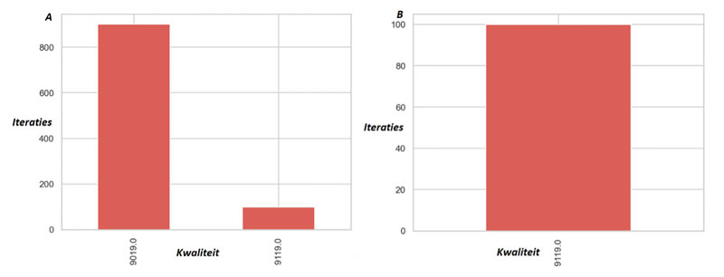
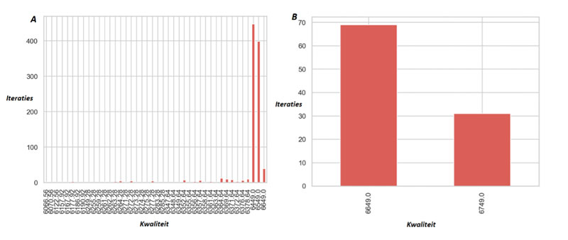
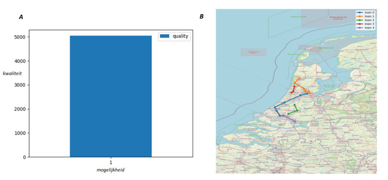
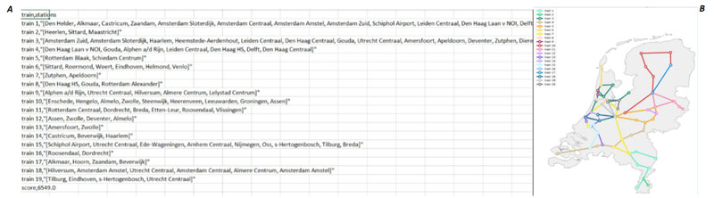
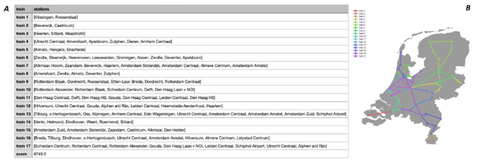
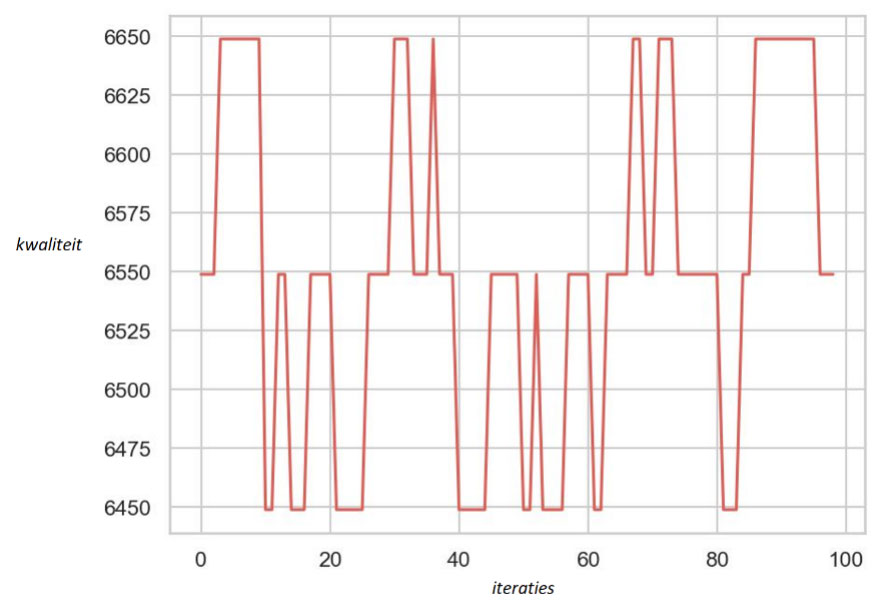

# Experiment

## Doel van het experiment

De uitdaging bij dit vak is om de case zo goed mogleijk op te lossen, daarbij is het belangrijk op wat voor manier je de oplossing vindt. Om achter de juiste oplossing te komen hebben we meerdere algoritmes geschreven. In dit document geven we de resultaten en een analyse van het experiment.

In de folder "experiment" `../data/experiment/` is de distributie opgeslagen.

## Eerste Analyse:
### Kwaliteit Traveling Salesman en Simulated Annealing

### *Holland*

`Simulated Annealing - max kwaliteit: 9119.0`

`Traveling Salesman - max kwaliteit: 9119.0`

Het Simulated Annealing (SA) algoritme heeft een hogere maximale kwaliteit dan het Traveling Salesman (TS) algoritme. De kwaliteit van de lijnvoering bij het TS is verdeeld in een kwaliteit van 9019 en 9119 (Figuur 1A). De hogere kwaliteit (9119) bij TS is gelijk aan de constante kwaliteit van SA (Figuur 1B). Dit komt omdat het TS één bepaalde richting kiest en daarop een traject creëert; bij SA worden de trajecten die bij TS gecreëerd zijn aangepast en verbeterd. Bij SA zal dit dus altijd resulteren in een optimale kwaliteit van de lijnvoering. Verder is het SA honderd keer uitgevoerd en TS duizend keer. Dit komt omdat de kwaliteit van de SA naar 100 keer al stabiel is; bij TS duurt het langer voordat de kwaliteit stabiel is.

*Figuur 1. A. Barplot van de verdeling van de kwaliteit van het TS algoritme op Holland-gebied na 1000 iteraties. De x-as is de kwaliteit en de y-as hoe vaak deze kwaliteit de uitkomst was van het algoritme. B. Barplot van de verdeling van de kwaliteit van het SA algoritme op Holland-gebied na 100 iteraties. De x-as is de kwaliteit en de y-as hoe vaak deze kwaliteit de uitkomst was van het algoritme.*

### *Nationaal*
`Simulated Annealing - max kwaliteit: 6749.0`

`Traveling Salesman - max kwaliteit: 6649.0`

SA algoritme heeft weer een hogere maximale kwaliteit (6749) dan TS (6649). Op nationaal niveau hebben TS en SA allebei een kwaliteitsverdeling (Figuur 2A, 2B). Verder is er een sterke verdeling te zien bij TS. Dit komt omdat alle lijnvoeringen waarin niet alle verbindingen worden bereden ook in de barplot worden gevisualiseerd. Ook is het daarbij belangrijk om te realiseren dat de verdeling waarschijnlijk nog beter te zien is bij meer iteraties. Er kan wel geconcludeerd worden dat de verdeling wel ongeveer gelijk zal blijven bij SA, 6649 (~70%) en 6649 (~30%).

*Figuur 2. A. Barplot van de verdeling van de kwaliteit van het TS algoritme op spoorwegen van Nederland na 1000 iteraties. De x-as is de kwaliteit en de y-as hoe vaak deze kwaliteit de uitkomst was van het algoritme. B. Barplot van de verdeling van de kwaliteit van het SA algoritme op spoorwegen van Nederland na 100 iteraties. De x-as is de kwaliteit en de y-as hoe vaak deze kwaliteit de uitkomst was van het algoritme.
Conclusie eerste analyse
Vanuit de eerste analyse kan er verondersteld worden dat de SA een hogere maximale kwaliteit heeft op nationaal niveau (6749) dan TS (6649) (Figuur 2). Op Holland niveau zijn de maximale kwaliteiten van de twee algoritmen gelijk, beide 9119 (Figuur 1).*
## Tweede Analyse: 
### Parameter tuning

In het optimalisatie-project bestaan er meerdere parameters die getuned kunnen worden. Met tunen wordt bedoeld dat de parameters zo worden gekozen dat de kwaliteit van de lijnvoering het hoogste is. In dit project zijn de parameters, die kunnen worden getuned: temperatuur (`T`), iteraties in het algoritme (hoe vaak mag hij iets veranderen) (`IA`), iteraties met hoe vaak hij van het begin af aan gaat veranderen (`IB`), iteraties hoe vaak je het TS moet uitvoeren (`ITS`) (Tabel 1).  

***Tabel 1.*** *Overzicht van de verschillende domeinen voor de parameters.*
| Parameter | Domein    |
|-----------|-----------|
|Temperatuur (`T`)|[1, 10, 20, 100, 1000, 10000, 100000]|
|Iteraties in het algoritme (hoe vaak mag hij iets veranderen) (`IA`)|[10, 20, 30, 50, 100]|
|Iteraties met hoe vaak hij van het begin af aan gaat veranderen (`IB`)|[1, 10, 100]|
|Iteraties hoe vaak je TS moet uitvoeren (`ITS`)|[10, 100, 1000]|

In totaal zijn er dus 7 x 5 x 3 x 3 = 315 mogelijkheden. Door middel van de grid search methode (elke combinatie afgaan) is de meest optimale combinatie van parameters gevonden (Tabel 2). Bij het Holland-gebied geven alle verschillende combinaties van de parameters dezelfde kwaliteit voor SA en TS. Het kan zijn dat dit komt doordat de kwaliteit al redelijk hoog is, en kleine aanpassingen in de parameters daar weinig aan kunnen veranderen. Verder is er op Nationaal-gebied wel een optimale parametercombinatie, namelijk [1, 10, 1, 10]. Dit is voor SA en TS hetzelfde.

***Tabel 2.*** *Overzicht van de optimale parametercombinaties per gebied en per algoritme.*

| Gebied            | Algoritme         |  [ `T`, `IA`, `IB`, `ITS` ] | Kwaliteit         |
| ----------------- | ----------------- | ----------------- | ----------------- |
| Holland           | SA                | Alle combinaties  | 9119              |
| Holland           | TS                | Alle combinaties  | 9019              |
| Nationaal         | SA                | [1, 10, 1, 10]    | 6749              |
| Nationaal         | TS                | [1, 10, 1, 10]    | 6549              |

### Tijdsmeting
De verschillende parametercombinaties hebben allen een verschillende tijdsduur. In het geval van het Holland-gebied, waarin alle combinaties dezelfde kwaliteit geven, is het interessant om naar deze tijdsduur te kijken. Dit omdat de parametercombinatie met de laagste tijdsduur de voorkeur heeft. De verschillende uitkomsten van de metingen met betrekking tot het Holland-gebied zijn weergegeven in Tabel 3. Aan de hand van de resultaten kan er worden geconcludeerd dat de parameters met de laagste waarden de laagste tijdsduur hebben. Er kan dan ook geconcludeerd worden dat de combinaties met de laagste parameterwaarden bij het Holland SA en TS de voorkeur hebben. Bij Holland en Nationaal hebben de parametercombinatie [1, 10, 1, 10] de voorkeur, omdat hierbij de kwaliteit het hoogst is en de tijdsduur het laagst (Tabel 2, 3, 4).

***Tabel 3.*** *Overzicht van de optimale parametercombinaties Holland.*
| Gebied            | Algoritme         |  [ `T`, `IA`, `IB`, `ITS` ]         | Tijd (sec)        |
| ----------------- | ----------------- | ------------------------- | ----------------- |
| Holland           | SA                | [1, 10, 1, 10]            | 0.162             |
| Holland           | SA                | [20, 20, 1, 100]          | 0.203             |
| Holland           | SA                | [1000, 20, 100, 10]       | 3.03              |
| Holland           | SA                | [100.000, 100, 100, 1000] | 8.59              |
| Holland           | TS                | [1, 10, 1, 10]            | 0.150             |
| Holland           | TS                | [20, 20, 1, 100]          | 0.398             |
| Holland           | TS                | [1000, 20, 100, 10]       | 0.193             |
| Holland           | TS                | [100.000, 100, 100, 1000] | 1.21              |

*Tabel 4. Overzicht van de optimale parametercombinaties Nationaal.*
| Gebied            | Algoritme         |  [ `T`, `IA`, `IB`, `ITS` ]         | Tijd (sec)        |
| ----------------- | ----------------- | ------------------------- | ----------------- |
| Nationaal           | SA                | [1, 10, 1, 10]            | 0.606             |
| Nationaal           | SA                | [20, 20, 1, 100]          | 0.284             |
| Nationaal           | SA                | [1000, 20, 100, 10]       | 12.0              |
| Nationaal           | SA                | [100.000, 100, 100, 1000] | 50.4              |
| Nationaal           | TS                | [1, 10, 1, 10]            | 0.218             |
| Nationaal           | TS                | [20, 20, 1, 100]          | 0.964             |
| Nationaal           | TS                | [1000, 20, 100, 10]       | 0.209             |
| Nationaal           | TS                | [100.000, 100, 100, 1000] | 6.64              |
 
## Derde Analyse: 
**Vergelijk de oplossing met de baseline**

De resultaten van de baseline wijken af van de andere algoritmen. Het baseline algoritme kiest altijd voor de verbinding met de laagste tijd. Door deze manier van redeneren blijft er soms een station over wat ervoor zorgt dat de uitkomst van de kwaliteit lager is. In Figuur 3B zie je bijvoorbeeld dat er verbindingen ontbreken (niet alle trajecten zijn met elkaar verbonden). De kwaliteit van deze lijnvoering in gevisualiseerd in Figuur 3A.

***Figuur 3. A.*** *Bar plot van de kwaliteit van de trajecten gegeneerd door het algoritme. Als de score 10.000 is dan is de hoogste kwaliteit behaald. B. Landkaart van Nederland waarin de trajecten gevisualiseerd zijn door verschillende kleuren lijnen.*

### Traveling Salesman
De resultaten van het TS algoritme wijken af van de baseline. In Figuur 4B is te zien dat alle verbindingen wel bereden worden bij TS.

***Figuur 4. A.*** *Tabel van gegenereerde trajecten door het TS. B. Landkaart van Nederland waarin de trajecten 
gevisualiseerd zijn door verschillende kleuren lijnen.*

De kwaliteit van TS is 6549 (Figuur 4A), wat hoger is dan de baseline. Dit komt omdat het TS algoritme op een andere manier werkt dan de baseline:
1.	Startstation kiezen die (nog) maar 1 beschikbare verbinding heeft. **Verschil: baseline kiest random startpunt.** 
2.	Stations met 2 of meer verbindingen kunnen vaker worden bezocht. **Verschil: bij baseline kan dit niet (mag maar 1 keer gebruik maken van een verbinding).**
3.	Als het dichtstbijzijnde station van het huidige station een station is dat al bezocht is en het andere opties heeft waar nog geen traject is langs geweest dan wordt het dichtstbijzijnde, nog niet bezochte, station gekozen. **Verschil: baseline mag niet vaker langs een station, waardoor deze stap niet in het baseline algoritme zit.**

### Simulated Annealing
SA heeft ongeveer dezelfde verschillen met de baseline als TS. Het nieuwe verschil is dat het SA algoritme de uitkomst van TS probeert te optimaliseren door middel van korte trajecten te knippen en plakken in andere trajecten. Hierdoor creëert SA minder trajecten wat moet resulteren in een hogere kwaliteit. Echter, vanuit de resultaten (Figuur 5A, 5B) is op te maken dat de kwaliteit van SA (6749) niet heel veel hoger is dan dat van TS (6549), wat dus het verschil met de baseline niet veel anders maakt dan bij TS.

***Figuur 5. A.*** *Tabel van gegenereerde trajecten door het SA. B. Landkaart van Nederland waarin de trajecten 
gevisualiseerd zijn door verschillende kleuren lijnen.*

De kwaliteit is 6749 (Figuur 5A), wat hoger is dan de baseline en hoger dan TS. Dit komt omdat het TS algoritme op een andere manier werkt dan de baseline:
1. SA pakt de lijnvoering van het TS als beginlijnvoering.
2. Dan pakt hij het kortste traject en probeert deze toe te voegen aan een ander langer traject waarin het korte traject past.
3. Hij voegt het korte traject toe aan het eerste en beste traject waar die bij past.
4. Bepaalt of die hem ervoor zet of erachter (haalt stuk ervoor of erachter eruit) dit blijft die honderd keer herhalen, of totdat alle overgebleven korte trajecten zijn weggewerkt.
5. Na honderd keer proberen het overgebleven traject ergens bij te voegen, wordt het in een leeg traject gezet. (train 1, 2, 5 in Figuur 5A).
6. Vervolgens worden alle trajecten korter gemaakt (tot de trajecten niet langer duren dan de max van 3 uur per traject). Wat er dan overblijft aan verbindingen wordt dan weer ergens anders gevoegd, mits mogelijk. Wat overblijft na 100 keer proberen wordt weer in lege trajecten geplaatst.

## Analyseer de structuur van de gevonden oplossingen zelf
### Waar komt kwaliteit precies vandaan?
De uiteindelijke kwaliteit van TS komt vooral door de (soms vaste) verschillende stappen die het algoritme moet zetten. Hij begint altijd met de stations met maar één verbinding. Verder mogen de stations met 2 of meer verbindingen vaker worden bezocht en als het algoritme moet kiezen tussen twee stations, dan kiest die altijd voor degene die nog niet is geweest. Door deze opbouw wordt er voorkomen dat verbindingen worden overgeslagen. Wel worden alle 20 trajecten gebruikt; ook trajecten met maar 1 verbinding (2 stations). Dit resulteert in een lagere kwaliteit. Om dit probleem op te lossen is er een SA algoritme toegepast op de uitkomst van TS.
De uiteindelijke kwaliteit van SA (die hoger is dan TS) komt door het knippen en plakken van gehele korte trajecten, trajecten met maar 1 of 2 verbindingen, in andere trajecten. Dit resulteert in een op en neer gaande kwaliteit (Figuur 6), want het algoritme ‘probeert’ heel veel verschillende trajecten, ook al is de kwaliteit soms minder goed. Wel is de uiteindelijke maximale kwaliteit hoger dan bij het TS algoritme, maar niet veel hoger dan TS. 

***Figuur 6.*** *Grafiek van alternerende kwaliteit door SA algoritme.*

## Waar ligt nog ruimte voor verbetering?
Er is wel een probleem met het SA algoritme: het lijkt alsof hij blijft hangen op een maximale kwaliteit; het lukt het algoritme niet om de kwaliteit beter te maken. Een oplossing zou kunnen zijn om in plaats van hele trajecten te knippen en te plakken, delen van trajecten te knippen (dus bijvoorbeeld maar 1 verbinding binnen een traject). Door gebrek aan tijd hebben wij dit laatste niet kunnen testen, maar dit zou zeker interessant zijn voor toekomstig onderzoek naar een beter algoritme. Verder hebben we vanaf het begin af aan een voorwaarde aan beide algoritmes (TS en SA) gegeven: het algoritme moet beginnen bij een station met maar 1 verbinding. Een alternatief op deze regel zou kunnen zijn dat het een prioriteit is om in plaats van te beginnen bij een station met 1 verbinding, te eindigen bij een station met 1 verbinding. Tot slot zou er in toekomstig onderzoek ook nog kunnen worden gekeken naar het gebruik van de coördinaten als voorwaarde. Bijvoorbeeld, beginnen bij de stations die het meest uit het midden liggen, dit om te voorkomen dat het algoritme altijd start bij 1 verbindingsstations. 

